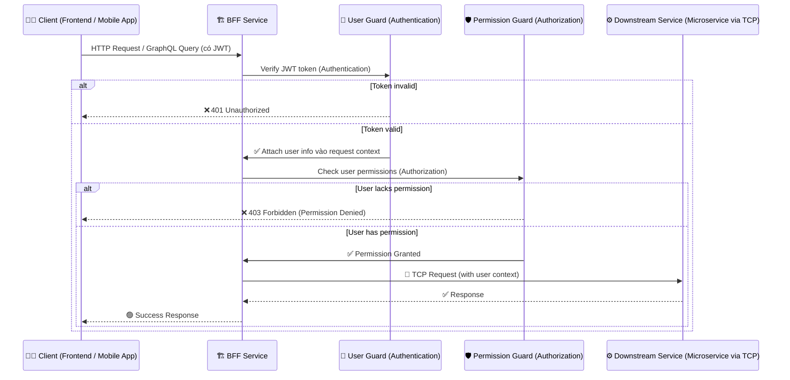

```mermaid
sequenceDiagram
    participant Client as 🧑‍💻 Client (Frontend / Mobile App)
    participant BFF as 🏗️ BFF Service
    participant UserGuard as 🔐 User Guard (Authentication)
    participant PermGuard as 🛡️ Permission Guard (Authorization)
    participant Downstream as ⚙️ Downstream Service (Microservice via TCP)

    Client->>BFF: HTTP Request / GraphQL Query (có JWT)
    BFF->>UserGuard: Verify JWT token (Authentication)
    alt Token invalid
        UserGuard-->>Client: ❌ 401 Unauthorized
    else Token valid
        UserGuard->>BFF: ✅ Attach user info vào request context
        BFF->>PermGuard: Check user permissions (Authorization)
        alt User lacks permission
            PermGuard-->>Client: ❌ 403 Forbidden (Permission Denied)
        else User has permission
            PermGuard->>BFF: ✅ Permission Granted
            BFF->>Downstream: 🚀 TCP Request (with user context)
            Downstream-->>BFF: ✅ Response
            BFF-->>Client: 🟢 Success Response
        end
    end

```
