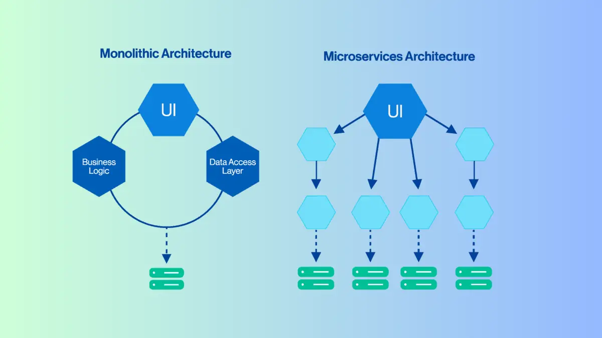
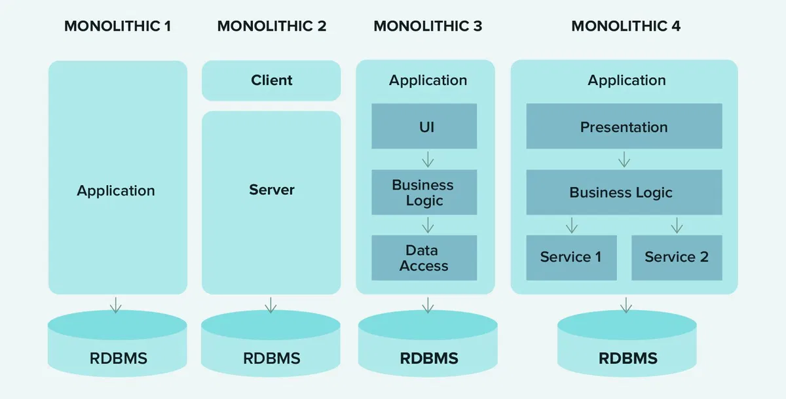
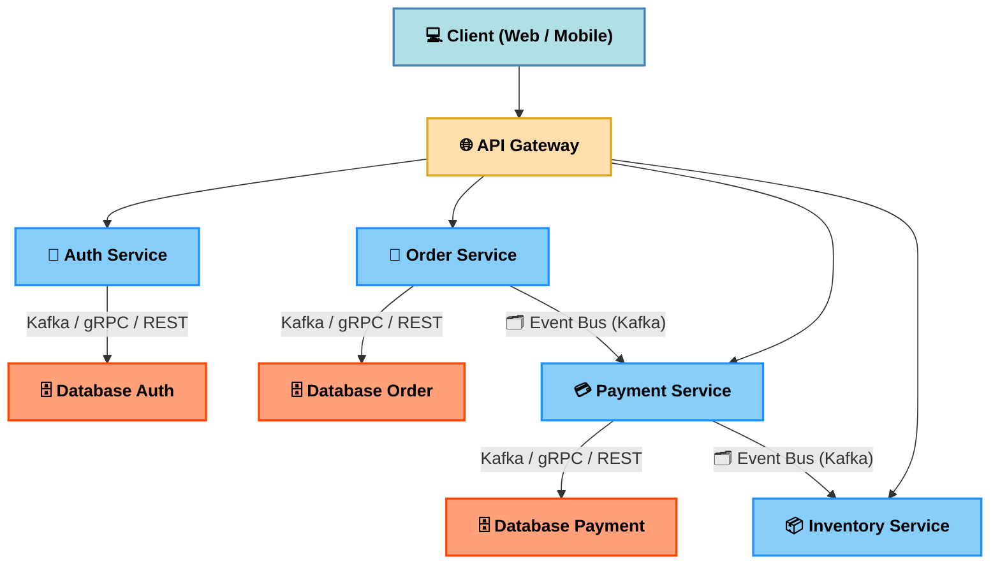

# Microservice Architecture

## Microservice là gì?

**Microservice** là một kiến trúc phần mềm trong đó hệ thống được chia thành nhiều **dịch vụ nhỏ** độc lập.  
Mỗi service đảm nhận **một chức năng riêng biệt**, có thể phát triển, triển khai và mở rộng độc lập.

**Đặc điểm chính:**

- **Independence**: Mỗi service có codebase riêng, deploy riêng.
- **Specialization**: Mỗi service chỉ tập trung vào một chức năng.
- **Scalability**: Có thể scale từng service độc lập.
- **Polyglot**: Mỗi service có thể dùng ngôn ngữ & công nghệ khác nhau.

## Monolithic là gì?

**Monolithic Architecture** là mô hình kiến trúc phần mềm trong đó **toàn bộ ứng dụng** (gồm frontend, backend, business logic, database access) được gói gọn và triển khai như **một khối duy nhất**.

**Đặc điểm**

- Một codebase duy nhất.
- Triển khai dưới dạng **một file** (hoặc container) duy nhất.
- Các module chia sẻ chung tài nguyên và runtime.

| Ưu điểm                                                                                                                | Nhược điểm                                                                                                       |
| ---------------------------------------------------------------------------------------------------------------------- | ---------------------------------------------------------------------------------------------------------------- |
| - Đơn giản để phát triển và triển khai ban đầu.  - Debug, test nhanh ở giai đoạn nhỏ. - Dễ quản lý khi team nhỏ. | - Khó mở rộng từng phần.  - Deploy phải build lại toàn bộ hệ thống.  - Dễ bị ảnh hưởng dây chuyền khi lỗi. |

## So sánh Monolithic vs Microservice

Tham khảo: [Microservices vs Monolithic](https://200lab.io/blog/microservices-la-gi/)

| Tiêu chí    | Monolithic               | Microservice                              |
| ----------- | ------------------------ | ----------------------------------------- |
| Codebase    | 1 codebase duy nhất      | Nhiều codebase nhỏ                        |
| Triển khai  | Deploy tất cả 1 lần      | Deploy từng service                       |
| Scale       | Scale toàn bộ app        | Scale từng service                        |
| Độ phức tạp | Thấp (ban đầu)           | Cao (quản lý service)                     |
| Rủi ro      | Lỗi 1 phần → sập toàn bộ | Lỗi 1 service → các service khác vẫn chạy |

## Cấu trúc Microservices

## Microservices giao tiếp với nhau ra sao?

Trong monolithic, gọi trực tiếp với nhau qua function nhanh không có lỗi.
Trong microservices, mỗi service:

- Chạy **độc lập**
- Có **database riêng**
- Deploy, scale **không đồng bộ** với service khác

⇒ Service **không thể gọi trực tiếp function** như trong monolith.

Thay vào đó, microservices **chỉ giao tiếp thông qua network**, phổ biến là:

- HTTP/gRPC
- Message broker
- Event streaming platform

Dưới đây là hình ảnh so sánh sự khác biệt cốt lõi:

## Những vấn đề phát sinh khi giao tiếp qua network

Khi giao tiếp qua network, hệ thống sẽ đối mặt với:

- **Latency:** có độ trễ cao chậm hơn gọi hàm nội bộ
- **Partial failure** service A sống, service B chết ➙ giao tiếp không được
- **Retry & duplicate message:** tình huống gửi lại message bị duplicate
- **Network không ổn định**

Hình ảnh dưới đây minh họa các thách thức này:

⇒ Thiết kế giao tiếp microservices thường **quan trọng hơn code business logic**.

## Các cách giao tiếp phổ biến trong Microservices

Microservices thường giao tiếp theo 2 hướng chính:

- **Synchronous** – gọi và chờ phản hồi
- **Asynchronous** – gửi rồi tiếp tục xử lý

## Giao tiếp đồng bộ diễn ra như thế nào?

### REST/HTTP

**Cách hoạt động**:

- Service A gửi request
- Service B xử lý và trả response
- Service A **bị block** cho đến khi nhận kết quả

**Ví dụ**: User mở trang chi tiết sản phẩm trong website thương mại điện tử

- Frontend gọi Product Service để lấy thông tin sản phẩm
- Product Service trả về tên, giá, mô tả
- Người dùng **cần dữ liệu ngay lập tức** để xem

⇒ Trường hợp này **bắt buộc dùng giao tiếp đồng bộ**.

**Khi nào nên dùng:** Querry lấy dữ liệu, Người dùng cần phản hồi ngay lập tức.
**Rủi ro cần kiểm soát**:

- **Timeout:** chỉ định ngưỡng nhất định, nếu quá ngưỡng timeout trả lỗi về phía client
- **Retry:** cơ chế retry có kiểm soát, chứ không phải lúc nào cũng retry dẫn tới duplicate message.
- **Circuit Breaker:** cơ chế ngắt kết nối **Partial failure**

### gRPC

Giao tiếp backend với backend hiệu năng cao
**Cách hoạt động**:

- Giao tiếp qua HTTP/2
- Dùng Protobuf thay vì JSON

**Phù hợp khi**:

- Service-to-service internal (backend to backend)
- Hệ thống lớn, traffic cao

⇒ gRPC **không thay thế REST**, mà bổ sung cho các luồng nội bộ.

## Giao tiếp bất đồng bộ diễn ra như thế nào?

### Message Queue

**Cách hoạt động**:

- Service A gửi message vào queue
- Service B xử lý sau, độc lập với A ➙ A **không bị block**

Hình ảnh dưới đây mô tả cách message queue hoạt động:

**Ví dụ:** Người dùng đặt hàng thành công
Hệ thống sẽ trả về kết quả ngay lập tức và hệ thống sẽ bắt đầu xử lý những tiến trình ở bên dưới (vd: tạo payment, trừ số lượng tồn kho, gửi email xác nhận...)

- Order Service lưu đơn hàng
- Gửi message `OrderCreated` vào queue
- Email Service xử lý gửi email xác nhận

⇒ Order **không cần chờ email gửi xong** để trả kết quả cho user.

**Lợi ích:** Không block, Chịu lỗi tốt, Dễ scale

## Event-Driven Communication

**Cách hoạt động**:

- Service phát sinh **event**
- Các service khác **lắng nghe và phản ứng xử lý**

Dưới đây là sơ đồ mô hình giao tiếp theo sự kiện (event-driven):

**Ví dụ**: Một đơn hàng được tạo thành công

- Order Service phát event `OrderCreated` thì 3 service khác lắng nghe và nhận được message
- Inventory Service trừ tồn kho
- Payment Service khởi tạo thanh toán
- Notification Service gửi thông báo

⇒ Order Service **không cần biết** có bao nhiêu service xử lý phía sau.
⇒ Service **không biết ai đang nghe mình** → coupling rất thấp.

## Nên chọn cách giao tiếp nào?

Không nên hỏi là Dùng công nghệ gì? ⇒ Hỏi đúng: _"Luồng nghiệp vụ này cần giao tiếp như thế nào?"_

**Rule of thumb**:

- Query dữ liệu → Sync
- Xử lý nền / side-effect → Async
- Thông báo thay đổi nghiệp vụ → Event

## Sai lầm phổ biến

❌ Giao tiếp đồng bộ cho mọi luồng
❌ REST chain quá nhiều service
❌ Thiếu timeout, retry, circuit breaker
❌ Lạm dụng event cho logic đơn giản

## Tổng kết bài học

- Microservices **luôn giao tiếp qua network**
- Network = không ổn định → phải thiết kế cẩn thận
- Kiến trúc tốt là kiến trúc **chọn đúng cách giao tiếp cho đúng bài toán**

> Microservice sai không nằm ở phía công nghệ, mà ở tư duy thiết kế.
