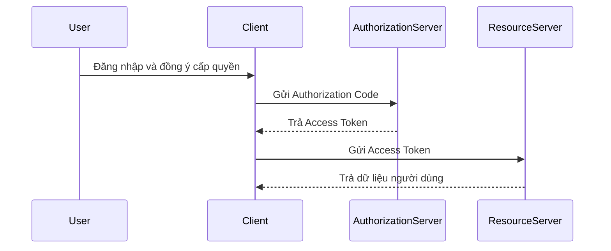
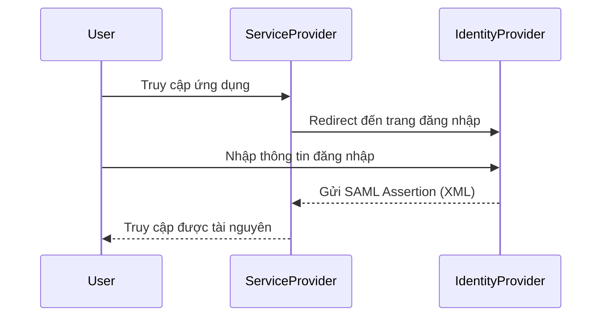
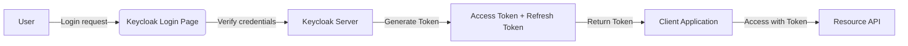

# Authentication Standards & Keycloak Flows

## Tổng quan về các chuẩn xác thực hiện đại

Trong ứng dụng hiện nay đặc biệt là **Microservices**, **API Gateway** và **Single Sign-On (SSO)** — việc hiểu rõ các **chuẩn xác thực (authentication standards)** là nền tảng để triển khai bảo mật đúng cách.

Ba chuẩn phổ biến nhất hiện nay là:

- **OAuth 2.0**
- **OpenID Connect (OIDC)**
- **SAML 2.0**

## OAuth 2.0 — Authorization Framework

### Mục đích

OAuth 2.0 là **framework uỷ quyền (authorization)**, cho phép ứng dụng bên thứ ba truy cập tài nguyên của người dùng mà **không cần chia sẻ mật khẩu**.

### Các thành phần chính

| Thành phần               | Vai trò                                     |
| ------------------------ | ------------------------------------------- |
| **Resource Owner**       | Người dùng sở hữu tài nguyên                |
| **Client Application**   | Ứng dụng muốn truy cập tài nguyên           |
| **Authorization Server** | Nơi xác thực và phát hành token             |
| **Resource Server**      | API hoặc dịch vụ chứa tài nguyên cần bảo vệ |

### Access Token & Refresh Token

- **Access Token**: dùng để truy cập API trong thời gian ngắn.
- **Refresh Token**: dùng để lấy lại Access Token mới khi token cũ hết hạn.

## OpenID Connect (OIDC) — Authentication Layer

### OIDC là gì?

OIDC mở rộng OAuth 2.0 để **xác thực danh tính người dùng**.  
Ngoài `Access Token`, nó bổ sung **ID Token** chứa thông tin người dùng (claims).

### Thành phần bổ sung

- **ID Token**: chứa thông tin người dùng (email, name, sub, ...).
- **UserInfo Endpoint**: API để truy vấn thông tin chi tiết user.

### So sánh OAuth2.0 vs OIDC

| Tiêu chí    | OAuth 2.0                    | OpenID Connect                |
| ----------- | ---------------------------- | ----------------------------- |
| Mục đích    | Uỷ quyền truy cập tài nguyên | Xác thực danh tính người dùng |
| Token chính | Access Token                 | Access Token + ID Token       |
| Dùng cho    | API, Backend, Service        | Web app, Mobile, SSO          |

## SAML 2.0 — Security Assertion Markup Language

### Tổng quan

SAML là chuẩn cũ hơn, dựa trên **XML**, dùng phổ biến trong **doanh nghiệp** và **SSO cho hệ thống nội bộ**.

### Kiến trúc

| Thành phần                  | Vai trò                                       |
| --------------------------- | --------------------------------------------- |
| **Identity Provider (IdP)** | Nơi xác thực người dùng                       |
| **Service Provider (SP)**   | Ứng dụng muốn xác thực                        |
| **Assertion**               | Gói thông tin XML chứng minh user đã xác thực |

### Nhược điểm

- Dựa trên XML → phức tạp, nặng nề.
- Không thân thiện với API và mobile. → OIDC được xem là phiên bản hiện đại hơn của SAML cho web hiện đại.

## So sánh giữa OAuth 2.0, OpenID Connect và SAML 2.0

| Tiêu chí                         | OAuth 2.0                           | OpenID Connect (OIDC)                         | SAML 2.0                                                 |
| -------------------------------- | ----------------------------------- | --------------------------------------------- | -------------------------------------------------------- |
| **Mục đích chính**               | Authorization truy cập tài nguyên   | Xác thực danh tính người dùng dựa trên OAuth2 | Xác thực người dùng giữa các hệ thống (SSO truyền thống) |
| **Định dạng dữ liệu**            | JSON (Access Token, Bearer Token)   | JSON (Access Token, ID Token - JWT)           | XML (SAML Assertions)                                    |
| **Giao thức nền tảng**           | HTTP + REST                         | HTTP + REST                                   | XML + SOAP                                               |
| **Phù hợp cho**                  | API, Mobile App, Service-to-Service | Web app, SPA, Mobile, SSO hiện đại            | Hệ thống enterprise, legacy, intranet                    |
| **Hỗ trợ SSO**                   | Không trực tiếp                     | Có (qua ID Token)                             | Có                                                       |
| **Dễ tích hợp với API hiện đại** | Cao                                 | Rất cao                                       | Thấp                                                     |
| **Độ phổ biến hiện nay**         | Rất cao (chuẩn cơ sở cho tất cả)    | Rất cao (SSO hiện đại)                        | Giảm dần, chỉ còn phổ biến trong enterprise              |
| **Ví dụ triển khai**             | Google OAuth, GitHub API            | Google Sign-In, Microsoft Login               | Azure AD SSO, Okta SAML Integration                      |

### Tóm tắt

- **OAuth 2.0**: nền tảng cho authorization giữa ứng dụng và tài nguyên.
- **OpenID Connect**: mở rộng OAuth 2.0 để thêm xác thực danh tính (authentication). Đây là chuẩn hiện đại cho **SSO, web và mobile**.
- **SAML 2.0**: phù hợp cho **doanh nghiệp, tổ chức lớn**, môi trường **intranet hoặc hệ thống cũ (legacy)**.

Với **Keycloak** có thể dùng cả ba chuẩn:

- **OIDC/OAuth2** cho ứng dụng web, API, microservices.
- **SAML 2.0** khi cần tương thích với hệ thống enterprise hoặc các nhà cung cấp SSO cũ.

## Authentication Flow trong Keycloak

Keycloak hỗ trợ nhiều **authentication flow** tuân theo chuẩn OIDC/OAuth2.0.

| Flow                          | Mô tả                           | Dùng cho             |
| ----------------------------- | ------------------------------- | -------------------- |
| **Authorization Code Flow**   | Web app có backend, bảo mật cao | Web, Server-side App |
| **Authorization Code + PKCE** | SPA, Mobile App                 | React, Flutter       |
| **Implicit Flow**             | SPA cũ, nay deprecated          | Không khuyến khích   |
| **Client Credentials**        | Service-to-Service              | Microservices        |
| **Resource Owner Password**   | CLI hoặc legacy app             | Không khuyến khích   |
| **Device Flow**               | IoT, Smart TV                   | Device không có UI   |

### Tổng quan luồng xác thực Keycloak

## Recap: Chọn chuẩn nào cho dự án?

| Tình huống         | Nên dùng chuẩn                          |
| ------------------ | --------------------------------------- |
| Web app có backend | OAuth2 + OIDC (Authorization Code Flow) |
| SPA / Mobile app   | OAuth2 + OIDC + PKCE                    |
| Legacy enterprise  | SAML 2.0                                |
| Service-to-service | OAuth2 Client Credentials               |
| IoT / Device app   | OAuth2 Device Flow                      |

## Kết luận

Keycloak là nền tảng mạnh mẽ giúp triển khai các chuẩn xác thực hiện đại như **OIDC**, **OAuth2.0**, và **SAML 2.0** một cách dễ dàng.  
Hiểu rõ từng flow và chuẩn giúp developer chọn giải pháp phù hợp với **kiến trúc Microservices** và đảm bảo hệ thống **an toàn, mở rộng và tuân thủ chuẩn quốc tế**.
