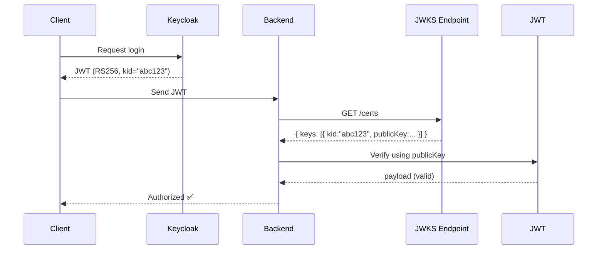

# Verify JWT trong NestJS sử dụng JWKS (Keycloak)

## JWT là gì?

Khi bạn đăng nhập qua **Keycloak**, bạn sẽ nhận được một **JWT (access token)** như sau:

```json
eyJhbGciOiJSUzI1NiIsImtpZCI6IjE2ZDJjNzEwIn0.eyJzdWIiOiIxMjM0NTY3ODkwIn0.Td2eY...
```

JWT gồm 3 phần:

1. **Header** – chứa metadata như thuật toán (`alg`) và `kid` (key ID):
   ```json
   { "alg": "RS256", "kid": "16d2c710" }
   ```
2. **Payload** – chứa thông tin (userId, roles, exp,...)
3. **Signature** – được ký bằng **private key** của Keycloak.

**Vấn đề: Làm sao verify chữ ký JWT?**

- Ứng dụng backend **không có private key** của Keycloak.
- Để kiểm tra token hợp lệ, bạn cần **public key** tương ứng để verify chữ ký.
- Keycloak cung cấp public key qua **JWKS endpoint**.

## JWKS là gì?

**JSON Web Key Set** là endpoint trả về **danh sách public keys** dưới dạng JSON.

Ví dụ endpoint Keycloak:

```
https://your-keycloak.com/realms/your-realm/protocol/openid-connect/certs
```

Kết quả:

```json
{
  "keys": [
    {
      "kid": "16d2c710",
      "kty": "RSA",
      "alg": "RS256",
      "use": "sig",
      "n": "ALsfK7F...",
      "e": "AQAB"
    }
  ]
}
```

## Cách verify token qua JWKS

1. Decode JWT → lấy `kid` từ header.
2. Fetch JWKS endpoint → lấy public key có `kid` trùng.
3. Verify chữ ký bằng public key.

## Thư viện `jwks-rsa` trong NestJS

```ts
this.jwksClient = jwksRsa({
  jwksUri: `${this.host}/realms/${this.realm}/protocol/openid-connect/certs`,
  cache: true,
  rateLimit: true,
})

const key = await this.jwksClient.getSigningKey(decoded.header.kid)
const publicKey = key.getPublicKey()
const payload = jwt.verify(token, publicKey, { algorithms: ['RS256'] })
```

Thư viện sẽ:

- Gọi JWKS endpoint.
- Cache key để giảm request.
- Verify chữ ký token tự động.

## Bảng tóm tắt

| Thuật ngữ    | Ý nghĩa                                        | Ví dụ                            |
| ------------ | ---------------------------------------------- | -------------------------------- |
| **JWT**      | Token chứa thông tin user, ký bằng private key | access_token                     |
| **JWKS**     | Danh sách public keys (JSON)                   | `/protocol/openid-connect/certs` |
| **kid**      | ID của key dùng để ký JWT                      | `"kid": "16d2c710"`              |
| **jwks-rsa** | Thư viện lấy public key để verify token        | npm `jwks-rsa`                   |

## Minh họa Flow


