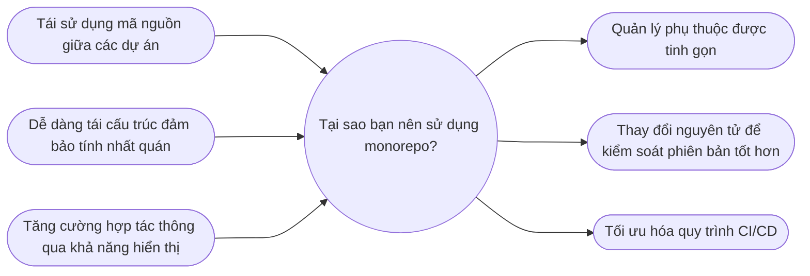
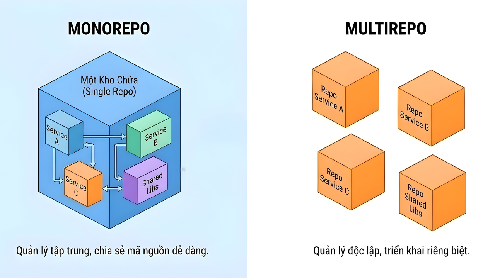

# Monorepo trong Microservice Project

## Monorepo là gì?

Trong **microservice**, thay vì tách từng service ra nhiều repository riêng biệt, **monorepo** cho phép **gom toàn bộ các service, thư viện chung, và công cụ hỗ trợ vào một repository duy nhất**.

**Ví dụ:**  
Dự án hệ thống **E-Invoice** có nhiều service như `user-service`, `invoice-service`, `mail-service`...  
Thay vì tạo nhiều repo, ta tổ chức tất cả trong một **monorepo**:

```text
e-invoice-project/
├── services/
│ ├── user-service/
│ ├── invoice-service/
│ └── mail-service/
├── libs/
│ ├── dto/
│ ├── common-utils/
│ └── event-contracts/
└── package.json
```

## Tại sao Monorepo hữu ích cho Microservice?



**Lợi ích chính:**

- **Chia sẻ code dễ dàng**:   Các thư viện chung (như `dto`, `utils`, `event-contracts`) có thể dùng cho nhiều service mà không cần publish package riêng.

- **Đồng bộ hoá dependency**: Tất cả service dùng chung version của dependency → tránh lỗi lệch version.

- **CI/CD đơn giản hơn**: Có thể thiết lập pipeline build/test cho toàn bộ project, hoặc cho từng service riêng ngay trong cùng repo.

- **Onboarding nhanh**:  Dev mới chỉ cần clone 1 repo là có toàn bộ codebase.

- **Quản lý version đồng bộ**: Các thay đổi lớn (breaking change) có thể kiểm soát ngay trong cùng repo, đảm bảo các service cập nhật kịp thời.

## Những thách thức khi dùng Monorepo

- **Repo phình to**: Khi số lượng service nhiều, repo trở nên nặng, clone/build mất thời gian.
- **Quyền truy cập**: Khó phân quyền theo từng service, vì tất cả code chung 1 repo.
- **CI/CD phức tạp hơn ở quy mô lớn**: Cần tối ưu pipeline để chỉ build/test service thay đổi, tránh chạy lại toàn bộ.

## So sánh nhanh: Monorepo vs Multirepo trong Microservice



| Tiêu chí           | Monorepo                                         | Multirepo                                    |
| ------------------ | ------------------------------------------------ | -------------------------------------------- |
| **Tổ chức code**   | Tất cả trong 1 repo                              | Mỗi service có repo riêng                    |
| **Chia sẻ code**   | Dễ dàng (libs chung)                             | Khó khăn, cần publish package hoặc copy code |
| **CI/CD**          | 1 pipeline chung, có thể điều hướng theo service | Mỗi repo có pipeline riêng, độc lập hơn      |
| **Dependency**     | Đồng bộ, kiểm soát tốt                           | Dễ lệch version, khó đồng bộ                 |
| **Quyền truy cập** | Ai có quyền repo → thấy toàn bộ                  | Có thể phân quyền chi tiết theo service      |
| **Quy mô**         | Phù hợp team nhỏ, service vừa và ít              | Phù hợp team lớn, service nhiều và phức tạp  |
