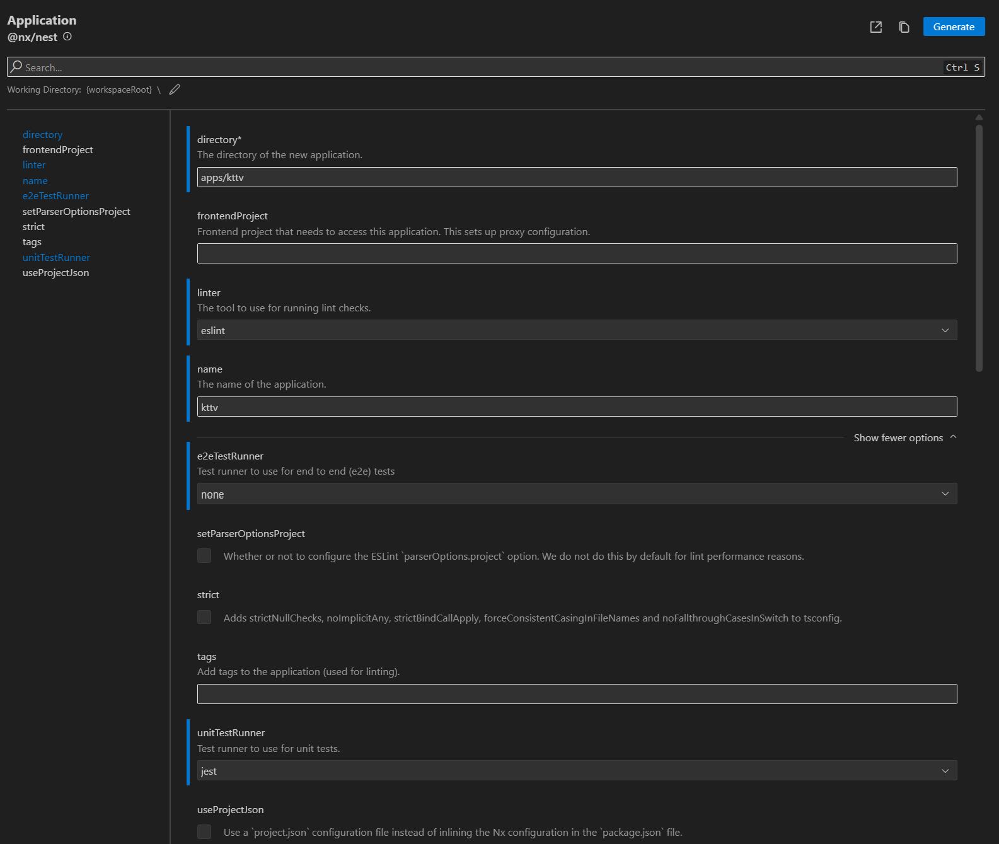
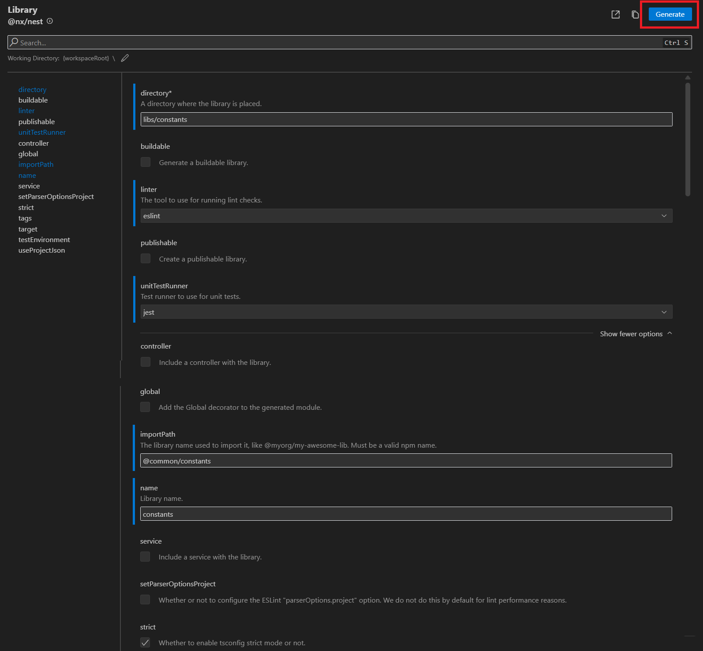

# Nx Monorepo cho Microservice với NestJS

## Nx là gì?


[Nx](https://nx.dev/) là một **smart build system** và **monorepo tool** dành cho JavaScript/TypeScript ecosystem.  
Nó giúp các team tổ chức code trong **monorepo** một cách tối ưu, cho phép quản lý nhiều ứng dụng (apps) và thư viện (libs) trong cùng một repository.

**Tóm gọn:** Nx là công cụ giúp **quản lý, build, test, lint, deploy** các dự án trong monorepo nhanh và hiệu quả.

## Tại sao nên dùng Nx cho Microservice?

Trong dự án Microservice, chúng ta có nhiều service độc lập: `user-service`, `invoice-service`, `mail-service`, ...  
Thay vì quản lý nhiều repo (multirepo), Nx cho phép gom vào **1 repo duy nhất (monorepo)**, với nhiều lợi ích:

- **Quản lý tập trung**: Tất cả service + libs chung nằm trong cùng một repo.
- **Tái sử dụng code dễ dàng**: DTOs, utils, validation, event-contracts có thể dùng lại.
- **Build/test nhanh**: Nx có cơ chế **affected graph**, chỉ build/test phần code thay đổi.
- **Code consistency**: Đồng bộ coding style, linting, testing cho toàn bộ hệ thống.
- **Plugin ecosystem**: Nx hỗ trợ sẵn plugin cho NestJS, React, Next.js, Angular,...

## Cấu trúc cơ bản trong Nx Monorepo

Khi khởi tạo bằng `npx create-nx-workspace`, cấu trúc dự án thường như sau:

```bash
my-workspace/
├── apps/ # Chứa các ứng dụng (microservices hoặc frontend apps)
│ ├── user-service/
│ ├── invoice-service/
│ └── bff/
│
├── libs/ # Chứa các thư viện tái sử dụng
│ ├── dto/
│ ├── utils/
│ └── event-contracts/
│
├── nx.json # Cấu hình Nx
├── project.json # Cấu hình project apps/libs
├── package.json # Quản lý dependencies
└── tsconfig.base.json # Config chung cho TypeScript
```

## Cách hoạt động của Nx

Nx theo dõi **dependency graph** của toàn bộ repo.  
Ví dụ:

- Khi thay đổi file trong `libs/dto`, Nx biết `user-service` và `invoice-service` bị ảnh hưởng → chỉ build/test các service này.

Điều này giúp tiết kiệm thời gian CI/CD, thay vì build lại toàn bộ repo.

## Lợi ích của Nx so với Monorepo thủ công

| Tiêu chí                  | Monorepo thủ công      | Monorepo với Nx             |
| ------------------------- | ---------------------- | --------------------------- |
| Quản lý dependencies      | Thủ công               | Tự động (dependency graph)  |
| Build/Test                | Toàn bộ project        | Chỉ phần ảnh hưởng          |
| CI/CD                     | Khó tối ưu             | Dễ tích hợp pipeline tối ưu |
| Code sharing              | Có thể, nhưng thủ công | Tích hợp sẵn                |
| Developer Experience (DX) | Bình thường            | Rất tốt (CLI + Plugin)      |

## Khởi tạo dự án với Nx CLI

Để cài đặt Nx CLI:

```bash
npm add --global nx
```

Khởi tạo project mới với NestJS:

```bash
npx create-nx-workspace <my-workspace> --preset=nest --packageManager=pnpm
```

Cách thực hiện để khởi tạo project mới:

<pre style="background-color: #0d1117; color: #c9d1d9; padding: 16px; font-family: Consolas, 'Courier New', monospace; font-size: 14px; line-height: 1.5; border-radius: 6px; overflow-x: auto;">
<span>C:\Users\admin\OneDrive\Máy tính&gt;npx create-nx-workspace kttv-portal --preset=nest --packageManager=pnpm</span>
<span>Need to install the following packages:</span>
<span>create-nx-workspace@22.2.0</span>
<span>Ok to proceed? (y) y</span>

<span style="background-color: #2f748f; color: black; padding: 0 4px; font-weight: bold;"> NX </span>  Let's create a new workspace [https://nx.dev/getting-started/intro]

<span style="color: #2ea043;">√</span> Application name · <span style="color: #2ea043;">bff</span>
<span style="color: #2ea043;">√</span> Would you like to generate a Dockerfile? [https://docs.docker.com/] · <span style="color: #58a6ff;">No</span>
<span style="color: #2ea043;">√</span> Which unit test runner would you like to use? · <span style="color: #58a6ff;">jest</span>
<span style="color: #2ea043;">√</span> Would you like to use ESLint? · <span style="color: #58a6ff;">Yes</span>
<span style="color: #2ea043;">√</span> Would you like to use Prettier for code formatting? · <span style="color: #58a6ff;">Yes</span>
<span style="color: #2ea043;">√</span> Which CI provider would you like to use? · <span style="color: #58a6ff;">gitlab</span>

<span style="background-color: #2f748f; color: black; padding: 0 4px; font-weight: bold;"> NX </span>  Creating your v22.2.0 workspace.

<span style="color: #a371f7;">√</span> Installing dependencies with pnpm
<span style="color: #a371f7;">√</span> Successfully created the workspace: kttv-portal
<span style="color: #a371f7;">√</span> CI workflow has been generated successfully
<span style="color: #a371f7;">√</span> Nx Cloud has been set up successfully

<span style="background-color: #2ea043; color: black; padding: 0 4px; font-weight: bold;"> NX </span>  <span style="color: #2ea043;">Your CI setup is almost complete.</span>
<span>Push your repo, then go to Nx Cloud and finish the setup: https://cloud.nx.app/c onnect/oFpPIek8BR</span>
</pre>

## Nx Console

Đầu tiên, cần cài đặt Extension **Nx Console** trên VSCode
Gõ `Ctrl+Shift+P` → Tìm `Nx Generate` để tạo app hoặc lib mới.

- App: `@nx/nest:application`
- Lib: `@nx/nest:library`

Tạo app trên giao diện của Nx Console.



Tạo libs trên giao diện của Nx Console.



Check lại path ở `tsconfig.base.json` khi tạo libs:

```ts
{
  "compileOnSave": false,
  "compilerOptions": {
    ...,
    "paths": {
      "@common/configuration/*": ["libs/configuration/src/lib/*"],
      "@common/constants/*": ["libs/constants/src/lib/*"],
    }
  }
}
```

## Các lệnh cơ bản Nx

- **Tạo service mới (NestJS):**

```bash
nx g @nestjs/schematics:application user-service
```

- **Tạo library dùng chung:**

```bash
nx g @nestjs/schematics:library dto
```

- **Xem dependency graph:**

```bash
nx graph
```

- **Chạy service:**

```bash
nx serve user-service
```

- **Chạy nhiều task trong project**

```bash
npx nx run-many -t build lint test
```

## Kết luận

Nx là công cụ mạnh mẽ để quản lý **monorepo trong dự án microservice**.  
Nó không chỉ giúp tổ chức code gọn gàng, mà còn tối ưu hóa build/test/deploy, cải thiện hiệu suất CI/CD, và nâng cao trải nghiệm lập trình.
