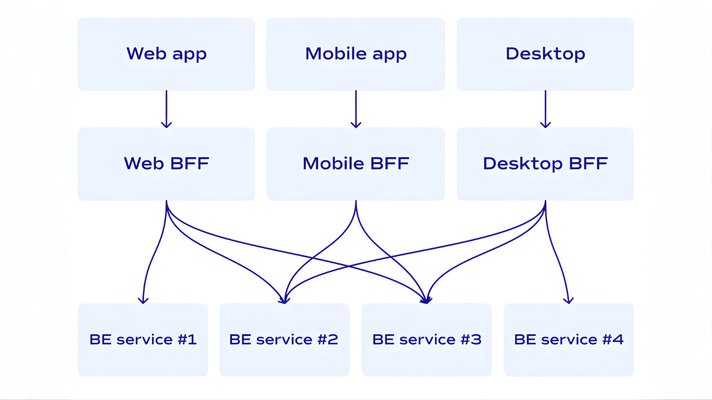
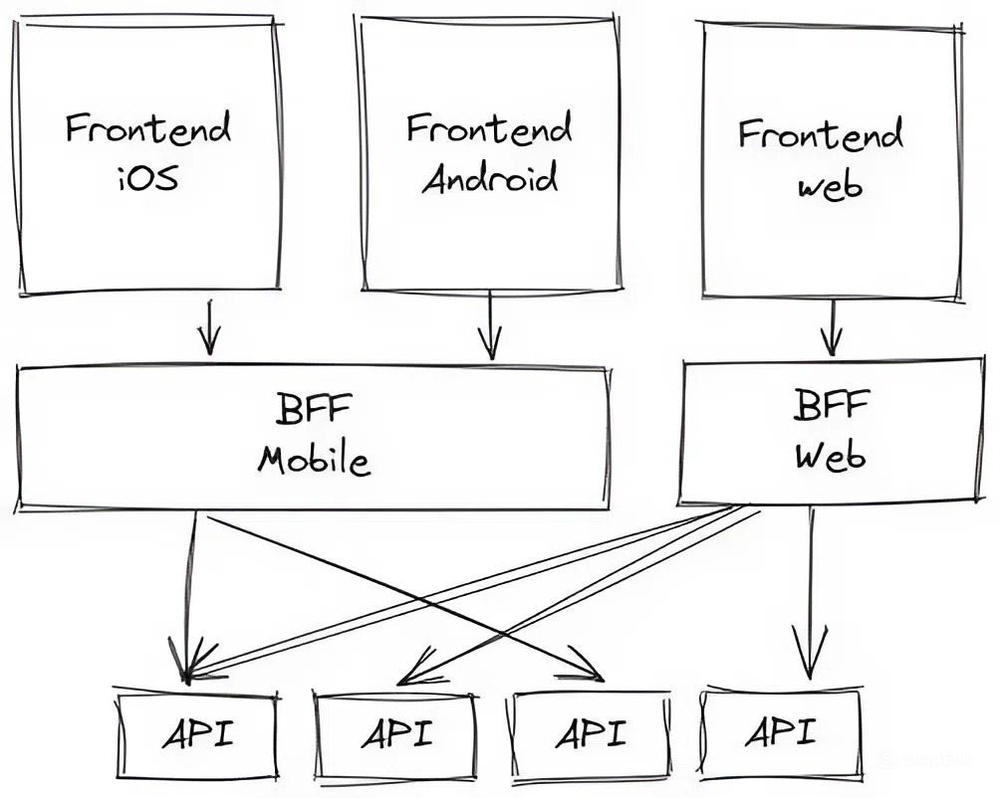
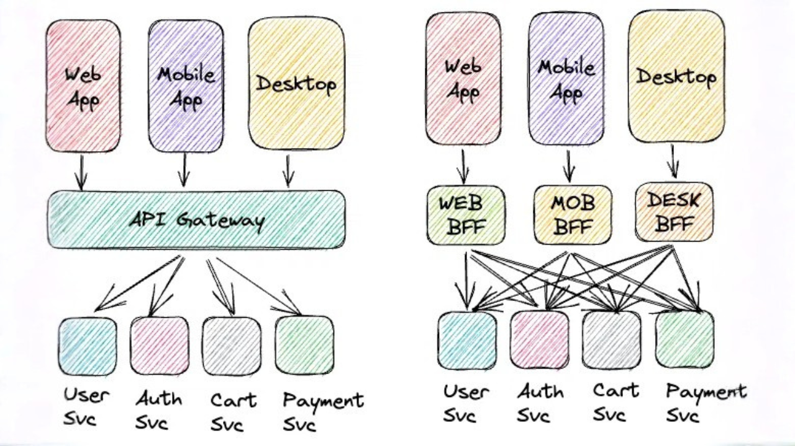

# Kiến trúc Backend for Frontend (BFF)

Tham khảo từ: [Kiến trúc Backend for Frontend](https://200lab.io/blog/backend-for-frontend-la-gi)

## BFF là gì?

[Backend for Frontend](https://200lab.io/blog/backend-for-frontend-la-gi) là kiến trúc trong đó bạn tạo ra các backend riêng biệt cho từng loại frontend cụ thể.
Thay vì sử dụng một API chung cho tất cả các giao diện người dùng (web, mobile, desktop), chúng ta có thể xây dựng các backend được tùy chỉnh để đáp ứng nhu cầu riêng của từng loại giao diện.
-> Điều này giúp backend đáp ứng đúng nhu cầu dữ liệu và logic cho từng frontend cụ thể, tối ưu hiệu suất và trải nghiệm người dùng.

## Tại sao sử dụng BFF?

- **Tối ưu, tăng trải nghiệm người dùng:** Bằng việc thiết kế backend riêng cho từng frontend, BFF chỉ gửi dữ liệu cần thiết cho client đó, giảm thời gian tải và làm ứng dụng chạy mượt hơn (ví dụ mobile chỉ nhận dữ liệu nhỏ gọn hơn so với web).
- **Tăng tốc độ phát triển:** Các nhóm phát triển backend cho từng frontend có thể làm việc song song độc lập, thay đổi và thử nghiệm độc lập mà không ảnh hưởng đến nhau.
- **Dễ dàng quản lý logic riêng biệt:** Logic xử lý dữ liệu dành riêng cho từng frontend được đặt trong BFF tương ứng, giúp frontend đơn giản hơn và backend chuẩn hóa hơn.

## BFF hoạt động như thế nào?

- Request từ Client: Ứng dụng frontend gửi request đến BFF của nó.
- Xử lý tại BFF: BFF nhận request, gọi đến các microservice cần thiết, xử lý dữ liệu và định dạng kết quả phù hợp.
- Response đến Client: BFF gửi dữ liệu đã được tùy chỉnh trở lại cho ứng dụng frontend.

## Khi nào nên sử dụng BFF?

- **Kiến trúc Microservices:** Khi backend đã được tách ra thành rất nhiều microservices và frontend cần dữ liệu tổng hợp từ nhiều service, việc dùng BFF giúp dễ dàng gom & xử lý dữ liệu trước khi gửi đến client.
- **Cần phải tối ưu hoá hiệu suất của ứng dụng:** Khi một API chung làm chậm hoặc gửi dữ liệu không phù hợp cho các frontend khác nhau, BFF giúp tùy chỉnh và tối ưu hóa từng luồng dữ liệu riêng.

## So sánh API Gateway và BFF

| Tiêu chí          | API Gateway                                                                               | BFF                                                                                   |
| ----------------- | ----------------------------------------------------------------------------------------- | ------------------------------------------------------------------------------------- |
| Mục đích chính    | Cung cấp một điểm **truy cập chung** cho tất cả client                                    | Cung cấp **backend riêng cho từng loại** frontend                                     |
| Phạm vi           | Phục vụ **tất cả các client một cách chung chung**, nhất quán theo hệ thống.              | Chỉ phục vụ **một frontend cụ thể**; mỗi frontend có BFF riêng.                       |
| Logic nghiệp vụ   | Chủ yếu **routing, xác thực, rate limiting, logging**; ít xử lý logic nghiệp vụ phức tạp. | Xử lý **logic nghiệp vụ riêng**, tổng hợp và định dạng dữ liệu theo frontend cần.     |
| Tối ưu hóa        | Tối ưu **toàn hệ thống** đảm bảo an toàn, ổn định, thống nhất.                            | Tối ưu **riêng cho từng frontend**: chỉ gửi dữ liệu cần thiết, giúp tăng trải nghiệm. |
| Độ linh hoạt      | Thay đổi ở API Gateway có thể ảnh hưởng đến toàn bộ hệ thống.                             | Mỗi BFF hoạt động độc lập → thay đổi trên BFF này không ảnh hưởng đến BFF khác.       |
| Cách tiếp cận     | **Tập trung**: một gateway đứng trước toàn bộ dịch vụ backend.                            | **Phân tán**: nhiều backend riêng cho từng frontend.                                  |
| Quản lý & Bảo trì | Dễ quản lý một điểm duy nhất nhưng có thể trở thành điểm nghẽn.                           | Cần bảo trì nhiều backend nhưng linh hoạt hơn cho từng client.                        |
