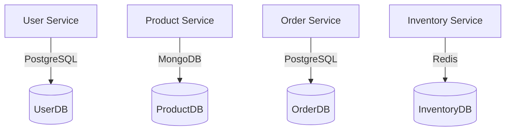
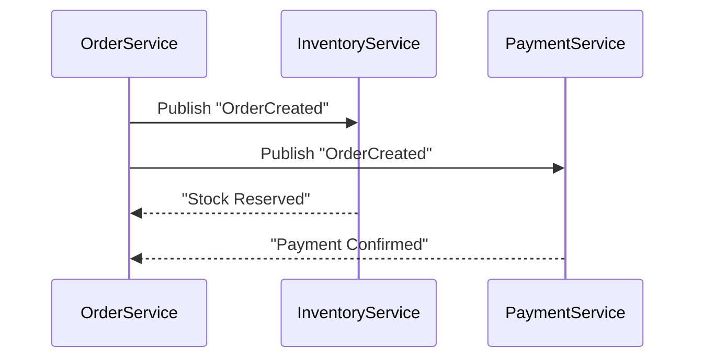

# Database in Microservice Architecture

## Database Patterns

- **Database per Service (Best Practice)**
- **Shared Database (Anti-pattern)**
- **Polyglot Persistence**

## Database per Service

**Mỗi service có DB riêng** → tránh coupling, dễ scale.

## Communication Between Services

- **Synchronous (API Call)**
- **Asynchronous (Event-driven)**

## SQL vs NoSQL trong Microservice

| Use Case                 | SQL (Postgres/MySQL) | NoSQL (MongoDB, DynamoDB)          |
| ------------------------ | -------------------- | ---------------------------------- |
| Dữ liệu quan hệ phức tạp | ✅ Rất phù hợp       | ❌ Không mạnh                      |
| Cần scale write lớn      | ❌ Khó hơn           | ✅ Dễ dàng (sharding, replication) |
| Flexible schema          | ❌ Schema cứng       | ✅ Thêm field dễ dàng              |
| Transaction mạnh         | ✅ ACID đầy đủ       | ❌ Hạn chế                         |

Thực tế: Hệ thống lớn thường **Polyglot Persistence**.

## Case Study

### Case 1: E-commerce Checkout 🛒

- **Services**: `CartService`, `OrderService`, `PaymentService`, `InventoryService`.
- **Database choice**:
  - `CartService` → Redis (cache, lưu giỏ hàng tạm).
  - `OrderService` → PostgreSQL (transaction mạnh).
  - `PaymentService` → PostgreSQL (ACID cần thiết).
  - `InventoryService` → Redis (realtime stock).
- **Challenge**: đồng bộ stock khi nhiều đơn hàng cùng lúc.
- **Solution**: dùng **Saga Pattern + event-driven** để rollback khi thanh toán/stock fail.

### Case 2: Ticket Booking System 🎟️

- **Services**: `UserService`, `BookingService`, `PaymentService`.
- **Database choice**:
  - `UserService` → PostgreSQL.
  - `BookingService` → MongoDB (ghế ngồi có cấu trúc động, nhiều trường linh hoạt).
  - `PaymentService` → PostgreSQL.
- **Challenge**: tránh overbooking khi nhiều người cùng đặt chỗ.
- **Solution**:
  - Dùng **optimistic locking** hoặc **distributed lock (Redis)** trong `BookingService`.
  - Publish `SeatReservedEvent` → lock ghế trong một khoảng thời gian.

### Case 3: Food Delivery App 🚚

- **Services**: `RestaurantService`, `OrderService`, `DeliveryService`, `NotificationService`.
- **Database choice**:
  - `RestaurantService` → MongoDB (menu linh hoạt).
  - `OrderService` → PostgreSQL (đơn hàng cần transaction).
  - `DeliveryService` → PostGIS (Postgres + extension để xử lý geolocation).
  - `NotificationService` → Kafka + MongoDB (log event + message tracking).
- **Challenge**: scale realtime order tracking.
- **Solution**: dùng **event streaming (Kafka)** để đồng bộ trạng thái đơn hàng đến client.

## Summary

- Microservice = **mỗi service quản lý DB riêng**.
- Chọn DB dựa trên use case, không có “one size fits all”.
- Dùng **Event-driven + Saga Pattern** để giải quyết transaction phân tán.
- **Case thực tế** (E-commerce, Ticketing, Food Delivery) cho thấy SQL và NoSQL thường kết hợp cùng nhau trong Polyglot Persistence.
